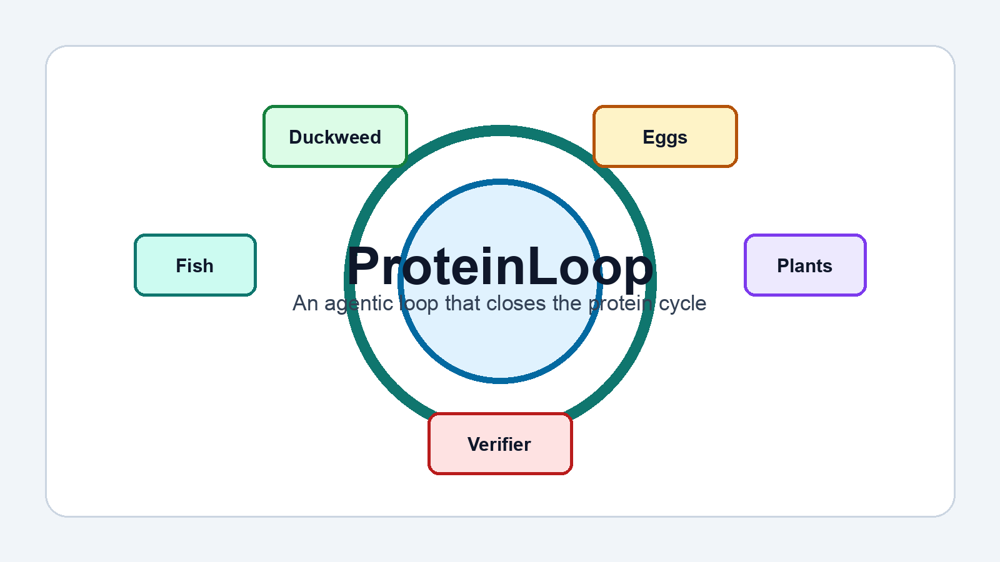
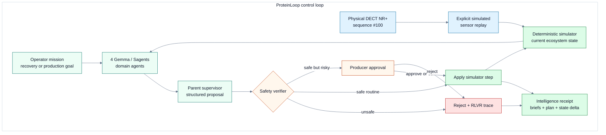
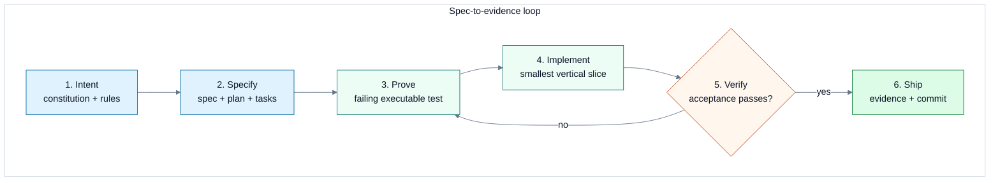

# ProteinLoop

<p align="center">
  
</p>

**Verifier-gated multi-agent control for a closed aquaponic protein loop.**

ProteinLoop lets an operator set an ecosystem mission, then coordinates fish, freshwater prawns, hydroponic plants, duckweed, and chickens through a [deterministic Python simulator](sim/proteinloop_sim), a [Phoenix LiveView control plane](app), and Gemma-powered Sagents agents. Models may propose actions; only deterministic rules and explicit producer approval can authorize state mutation.

[Run an intervention](#run-an-agentic-intervention) · [Run locally](#run-the-demo) · [System workflow](#system-workflow) · [Agentic development](#agentic-development-workflow) · [Evidence packet](#submission-packet)

## What Runs Today

| Capability | Executable behavior | Proof |
| --- | --- | --- |
| Real-time system understanding | Operator and producer routes share a Three.js aquarium with a local PBR fish model, detailed prawns, physical water and glass, bubbles, plants, and stress driven by the one-second simulator stream. | [Real-time tank spec](specs/056-realtime-tank-simulation/spec.md) · [Realistic scene spec](specs/057-realistic-aquarium-scene/spec.md) |
| Operator-directed intelligence | The operator selects a recovery or production mission and receives four specialist briefs, one supervisor plan, a verifier receipt, and the measured state change. | [Mission spec](specs/053-agentic-intervention-mission/spec.md) |
| Closed-loop physics | A naive policy collapses after an ammonia spike; the verified policy recovers. | [Demo evidence](submission/demo-evidence.md) |
| Real multi-agent runtime | Four Sagents domain agents report to a parent supervisor that returns a structured action. | [Sagents evidence](submission/sagents-evidence.md) |
| Local Gemma 4 | `google/gemma-4-E2B-it` runs behind the OpenAI-compatible `GEMMA_ENDPOINT` boundary. | [Gemma endpoint evidence](submission/local-gemma-evidence.json) |
| Deterministic safety | `verify_ecosystem_safety` rejects unsafe proposals before simulator mutation. | [RLVR trace evidence](submission/demo-rehearsal.md) |
| Human control | Risky actions pause for approve, edit-to-half, or reject before execution. | [HITL evidence](submission/sagents-evidence.md) |
| Distributed recovery | A two-node Horde runtime restores the same managed agent state after owner loss. | [Horde failover evidence](submission/horde-evidence.md) |
| Physical field link | Two nRF9151 boards exchange matching DECT NR+ sequence `#100` over a real radio link. | [DECT evidence](submission/nrf9151-live-evidence.md) |
| Reproducible application | Docker profiles start the simulator, guided operator control, producer view, and two-node runtime. | [Docker smoke evidence](submission/docker-smoke-evidence.json) |

## Run an Agentic Intervention

1. Open `http://localhost:4001/` and watch `Live tank simulation`: PBR fish and detailed prawns move continuously while Phoenix applies simulator snapshots every second.
2. Press `Simulate water emergency`. Water color, bubbles, and animal movement visibly transition to the deterministic ammonia-spike state.
3. In `Ask the AI team to help`, choose `Recover water quality`, `Protect protein yield`, or `Balance next 24h`.
4. Press `Ask AI team for a safe plan`. Gemma 4 E2B delegates the selected goal to four Sagents specialists and a parent supervisor.
5. Inspect the `Intelligence receipt` and watch the verified state change update the same tank scene.
6. Open `Advanced evidence and controls` only when you need DECT capture, simulator controls, runtime details, RLVR, or traces.
7. Open `http://localhost:4001/producer` to see the same live tank beside the approval workflow, without operator-only emergency or reset commands.

This is an action workflow, not a generated dashboard summary. The selected mission reaches every model call, while `verify_ecosystem_safety` remains the only authority allowed to admit a simulator mutation.

## System Workflow



The boundaries are deliberate:

- **Physical evidence:** Nordic `hello_dect` proves bidirectional radio transport. It is not presented as a chemical sensor reading.
- **Agentic intervention:** the operator's mission reaches all four specialists and the supervisor; the UI exposes structured recommendations and decisions, not hidden chain-of-thought.
- **Safety authority:** the Python verifier is the source of truth for admissible actions and RLVR reward.
- **Human authority:** irreversible or operationally risky actions remain paused until the producer approves, reduces, or rejects them.

## Agentic Development Workflow

Changes enter the repository through a fixed evidence loop. Code is not the source of product intent; the active feature spec is.



| Phase | Repository artifact | Exit condition |
| --- | --- | --- |
| Govern | [Constitution](.specify/memory/constitution.md) and [agent rules](AGENTS.md) | Safety, scope, and product constraints are explicit. |
| Specify | `specs/NNN-feature/spec.md` | User value and measurable acceptance criteria are written before code. |
| Plan | `plan.md` and `tasks.md` | One end-to-end vertical slice has clear ownership and guardrails. |
| Prove | Python, ExUnit, or contract tests | The intended behavior fails for the expected reason. |
| Implement | Simulator, verifier, harness, or LiveView code | The smallest complete behavior makes the focused test pass. |
| Verify | Full tests, Docker smoke, and generated evidence | Claims are backed by commands and artifacts, not implementation intent. |
| Ship | Git commit plus checksum manifest | Source, evidence, and documentation describe the same behavior. |

Every feature owns a `spec.md`, `plan.md`, and `tasks.md` under [`specs/`](specs). The current workflow is demonstrated by the [local Gemma submission profile](specs/050-local-gemma-submission/spec.md), the [DECT operator integration](specs/051-dect-operator-producer/spec.md), the [operator-directed intervention](specs/053-agentic-intervention-mission/spec.md), and the [visual plain-language system](specs/054-visual-plain-language-system/spec.md).

## Run Tests

From the repo root:

```sh
python3 -m unittest discover -s tests
```

Expected result:

```text
Ran 155 tests

OK
```

Run the Phoenix tests:

```sh
cd app
mix deps.get
mix test
```

Current expected result: `107 tests, 0 failures`.

Validate the GitHub Actions workflow contract before pushing:

```sh
make ci-check
```

The workflow uses the current release tags checked on GitHub Releases:

- `actions/checkout@v7.0.0`
- `actions/setup-python@v6.3.0`
- `erlef/setup-beam@v1.24.1`
- `docker/setup-buildx-action@v4.2.0`

Phoenix dependency pins were refreshed against Hex on July 7, 2026:

- `phoenix` latest stable: `1.8.9`.
- `phoenix_live_view` latest stable: `1.2.6`.
- `websock_adapter` latest stable: `0.6.0` through dependency resolution.
- Existing pins for `phoenix_html`, `phoenix_live_reload`, `lazy_html`, `esbuild`, `tailwind`, `bandit`, `req`, `gettext`, `jason`, `dns_cluster`, `telemetry_metrics`, and `telemetry_poller` already matched the latest stable Hex releases checked during the refresh.

Run the final submission readiness gate:

```sh
make submission-ready-check
```

The default local profile requires a reachable public GitHub repository and Application URL, matching `origin`, `submission/local-gemma-evidence.json`, and the real Sagents proof. Set `SUBMISSION_GEMMA_MODE=remote` only when validating an AMD-hosted or Fireworks endpoint; remote mode additionally requires non-loopback `submission/gemma-evidence.json`.

The final Application URL must be public. Localhost, loopback, and private-network URLs are intentionally rejected by `make submission-ready-check`.

After the public demo URL and the selected Gemma evidence are available, run the finalizer so generated artifacts are rebuilt in the correct order:

```sh
make submission-finalize
```

Preview the sequence without running it:

```sh
make submission-finalize DRY_RUN=1
```

Validate a public or local demo URL:

```sh
make live-demo-check DEMO_URL=http://127.0.0.1:4001
```

When the simulator API is public too:

```sh
make live-demo-check \
  DEMO_URL=https://your-demo-url \
  SIMULATOR_PUBLIC_URL=https://your-simulator-url
```

Preview updating the lablab Application URL:

```sh
make set-demo-url DEMO_URL=https://your-demo-url DRY_RUN=1
```

After the public route checks pass, `make set-demo-url` updates both `submission/lablab-submission.md` and `submission/lablab-form.json`.

Validate the public deployment Compose profile:

```sh
make public-deploy-check
```

Validate public deployment environment values:

```sh
SECRET_KEY_BASE="$(cd app && mix phx.gen.secret)"
PHX_HOST=your-demo-host \
SECRET_KEY_BASE="$SECRET_KEY_BASE" \
make public-env-check
```

Verify hackathon credit access before deploying Gemma:

```sh
FIREWORKS_API_KEY=your-fireworks-key \
AMD_CLOUD_STATUS=active \
make credit-check
```

Set `AMD_CLOUD_STATUS=active` only after the AMD Cloud console shows active credits and GPU quota. The Fireworks check calls the OpenAI-compatible `/models` endpoint and fails clearly when the API key or credits are not usable.

Validate an AMD-hosted or fallback OpenAI-compatible Gemma endpoint:

```sh
GEMMA_ENDPOINT=https://your-vllm-host \
GEMMA_MODEL=google/gemma-4-E2B-it \
make gemma-check
```

On success, the check writes `submission/gemma-evidence.json`.

The evidence must show that `/v1/models` advertises the requested Gemma 4 model and that `/v1/chat/completions` returns a valid ProteinLoop action.

Run the smallest Gemma 4 model, E2B IT, locally on Apple Silicon before using AMD cloud credits:

```sh
make local-gemma-install
make local-gemma-start
make local-gemma-check
```

The first start downloads Google's official QAT Q4 GGUF weights (about 2.9 GB for E2B weights, plus its multimodal projection/cache metadata). After that, the model runs offline at `http://127.0.0.1:8001/v1`. `make local-gemma-check` writes development evidence to `outputs/local-gemma-evidence.json`; `make local-gemma-submission-evidence` writes the strict local-profile artifact to `submission/local-gemma-evidence.json`. The managed server disables thinking for reliable low-latency JSON actions; the deterministic verifier still gates mutation. See `deploy/local-gemma.md` for lifecycle commands, memory assumptions, and the optional AMD promotion path.

With Docker and local Gemma running, generate the real Sagents proof:

```sh
make sagents-evidence
```

The target defaults to local E2B at `http://127.0.0.1:8001` and the simulator at `http://127.0.0.1:8000`; explicit environment variables still override both for AMD deployment. It runs four subsystem agents, a verified supervisor cycle, a HumanInTheLoop interrupt, and a rejection resume with zero mutation. It writes `submission/sagents-evidence.json` and `.md`.

Start the two-node Horde overlay and generate the state-preserving failover proof:

```sh
make horde-up
make horde-evidence
```

The overlay runs `proteinloop_web@web` on port `4001` and `proteinloop_peer@peer` on port `4012`, sharing Sagents persistence through a Docker volume. The verifier runs a real Gemma cycle, stops whichever service owns the managed agent, observes restoration on the survivor, restarts the stopped node, and writes `submission/horde-evidence.json` and `.md`.

With both nRF9151 DKs connected on their recorded VCOM0 ports, capture fresh physical DECT NR+ proof:

```sh
make nrf9151-live-evidence
```

The capture opens both ports read-only at 115200 baud, listens concurrently, and only replaces `submission/nrf9151-live-evidence.json` and `.md` when both FT and PT locally send and receive peer traffic. It never invokes a flash or reset command.

Summarize harness traces:

```sh
PYTHONPATH=sim python3 -m proteinloop_sim traces --path app/priv/traces/harness.jsonl
```

Run the lightweight RLVR policy evaluation:

```sh
PYTHONPATH=sim python3 -m proteinloop_sim rlvr
```

## Run the Demo

```sh
PYTHONPATH=sim python3 -m proteinloop_sim demo --days 8 --spike-day 1
```

The output compares two policies:

- `naive`: fixed feeding and low aeration, no chemistry response.
- `safety`: deterministic recovery policy that cuts feed, increases aeration, and exchanges water within verifier limits.

The current demo shows the naive system collapsing and the safety policy recovering.

## Run the Simulator API

```sh
PYTHONPATH=sim python3 -m proteinloop_sim serve --host 127.0.0.1 --port 8000
```

Endpoints:

- `GET /health`
- `GET /state`
- `POST /reset`
- `POST /scenario/ammonia_spike`
- `POST /step`
- `POST /policy/safety_step`
- `GET /rlvr/evaluation`
- `GET /rlvr/training`
- `GET /forecast/anomaly`

Example:

```sh
curl -X POST http://127.0.0.1:8000/scenario/ammonia_spike
curl -X POST http://127.0.0.1:8000/policy/safety_step
curl http://127.0.0.1:8000/state
```

## Run the LiveView App

Start the simulator first:

```sh
make serve
```

In another terminal:

```sh
cd app
mix deps.get
mix assets.setup
mix assets.build
SIMULATOR_URL=http://127.0.0.1:8000 PORT=4001 mix phx.server
```

Routes:

- Guided operator control: `http://localhost:4001/`
- Producer HITL and phone handoff: `http://localhost:4001/producer`

If port `4000` is free, omit `PORT=4001`.

## Agent Harness

The harness lives in `app/lib/proteinloop/agent/`.

Local demo providers:

- `:stub_safe`: emits a context-aware action that should pass the simulator verifier.
- `:stub_unsafe`: emits an overfeeding action that should be rejected before mutation.

The advanced agent harness has buttons for both paths. Rejected proposals keep the prior simulator state and show verifier violations.

`Advanced evidence and controls` includes `Run demo cascade`, which executes the core pitch flow in one action: reset, ammonia spike, unsafe verifier rejection, safe recovery, and trace recording.

The advanced harness includes a provider selector:

- safe stub;
- unsafe stub;
- OpenAI-compatible.

The advanced evidence includes model endpoint status. `Check model` probes `GEMMA_ENDPOINT/v1/models` and reports reachable, auth-required, unreachable, or not-configured status. This is the quick AMD-hosted Gemma or Fireworks fallback sanity check.

The advanced evidence includes an `RLVR reward verifier` panel. It compares the naive baseline against the safety candidate across repeatable simulator scenarios and shows average reward delta, recovered collapse scenarios, and collapse avoidance rate.

The same panel includes a deterministic policy search curve from `GET /rlvr/training`. Candidate policies are scored by `SafetyVerifier.reward`, and the control shows best-so-far improvement without requiring any training framework.

The advanced evidence includes `Subsystem agent topology` for fish tank, freshwater prawn, hydroponia, duckweed/chickens, and the parent supervisor. State mutation still goes through the harness and simulator verifier.

The advanced evidence includes a `Self-healing mesh` panel whose real Sagents/Horde status band shows distribution mode, participation membership, connected BEAM nodes, and managed-agent count. The `Simulate node loss` and `Recover node` controls remain a deterministic rehearsal; the actual service-stop proof is generated by `make horde-evidence`.

The physical hardware proof uses two Nordic nRF9151 DKs running Nordic `hello_dect`: PT `1051239227` maps to the tank sensor edge node and FT `1051223739` maps to the community gateway/controller. The committed evidence requires matching FT-to-PT and PT-to-FT sequence numbers from read-only serial capture. Connected boards are not required to replay Docker or CI; submission checks validate the captured artifact.

The first operational view is `Live tank simulation`, built with pinned Three.js `0.185.1`. It loads the Khronos Barramundi Fish PBR glTF model from the local application, clones shared geometry and textures across the school, and falls back to a muted procedural fish if loading fails. The bundled model is CC0 and its provenance and checksum are recorded in [`BARRAMUNDI-LICENSE.md`](app/priv/static/models/BARRAMUNDI-LICENSE.md). Detailed freshwater prawns, bubbles, varied substrate, plants, physical water and glass, soft shadows, and water-loop piping complete the scene. Phoenix patches simulator values every second without replacing the canvas. Ammonia changes water clarity and color; dissolved oxygen changes bubble activity, swimming speed, and whether fish move toward the surface. The operator route exposes `Simulate water emergency`; the producer route reuses the same animation in read-only mode. A light non-illustrated layer and readable HTML chemistry remain available if WebGL cannot start.

Inside advanced evidence, `Physical DECT NR+ link` shows the latest matching sequence and both board identities. `Replay sensor alert` maps that radio capture into the deterministic ammonia-spike simulator scenario, and `Run selected mission` starts the same verifier-gated Sagents cycle as the primary AI control. `/producer` shows the compact `Latest DECT NR+ link` status. Both views explicitly separate the physical radio proof from simulated water-quality values.

Separately, the stdlib telemetry bridge converts sample nRF9151 JSONL records into the future sensor contract: critical tank telemetry maps to `POST /scenario/ammonia_spike`, while an offline gateway report maps to the dashboard `mesh-fail-node` action. Those sample water-quality values are not attributed to the stock `hello_dect` logs.

The advanced evidence includes a `Human approval` panel. `Request producer approval` asks Gemma for an irreversible tool call, Sagents HumanInTheLoop pauses it before mutation, and the English producer route resumes that same Sagents call with approve, edit-to-half, or reject.

`Ask the AI team to help` is the primary Gemma workflow. The operator selects a concrete goal, and `Ask AI team for a safe plan` sends it to four subsystem agents concurrently. A fifth parent supervisor resolves their resource requests into one bounded action. The `Intelligence receipt` exposes each specialist brief, the supervisor note, deterministic verifier evidence, and before/after chemistry. The custom `verify_ecosystem_safety` mode still checks every action before execution, and `until_tool_success` returns only an admitted result.

The advanced evidence includes an `Anomaly forecast` panel. It forecasts near-term ammonia and oxygen risk under routine operation without mutating live simulator state, then recommends early intervention when chemistry is trending toward collapse.

The producer route includes an `Offline fallback` panel. It applies deterministic English emergency rules to the current readings, so a producer still gets clear local guidance when model/cloud services are unavailable.

The producer route also includes `WhatsApp/SMS message`: a short provider-free English text packet with tank status, proposed action, offline guidance, and `APPROVE` / `HALF` / `REJECT` reply options for low-bandwidth handoff.

Harness runs append trace data to:

```text
app/priv/traces/harness.jsonl
```

Each JSONL row contains the original state, proposed action, verifier result, resulting state, reward, provider, and timestamp. This is the first RLVR training artifact.

The dashboard renders the latest trace rows under `Trace timeline`. The Python trace summary reports accepted/rejected counts, provider counts, average accepted reward, and the latest verifier violations.

Optional OpenAI-compatible model boundary:

```sh
GEMMA_ENDPOINT=http://your-vllm-host:8000 \
GEMMA_API_KEY=optional \
GEMMA_MODEL=google/gemma-4-E2B-it \
SIMULATOR_URL=http://127.0.0.1:8000 \
PORT=4001 \
mix phx.server
```

The model endpoint is expected to expose `/v1/chat/completions` and return a JSON action with:

- `feed_kg`
- `aeration_hours`
- `water_exchange_fraction`
- `duckweed_harvest_kg`
- `note`

## Docker

Build and run the full demo:

```sh
docker compose up --build
```

Routes:

- Simulator API: `http://127.0.0.1:8000`
- Guided operator control: `http://localhost:4001/`
- Producer HITL: `http://localhost:4001/producer`

Open `Advanced evidence and controls`, then use `Run demo cascade` for the fastest end-to-end judge path.

The web container talks to the simulator at `http://simulator:8000` inside the Compose network. RLVR trace output is persisted in the `proteinloop_traces` Docker volume.

Smoke-test the running Docker demo:

```sh
make docker-smoke
```

On success this writes `submission/docker-smoke-evidence.json`, which the final readiness report consumes without rerunning local HTTP checks from inside the report generator.

## Public Repo CI

The GitHub Actions workflow lives at `.github/workflows/ci.yml`.

It runs on push, pull request, and manual dispatch. The first job runs `make test`, Phoenix dependency install, `mix format --check-formatted`, `mix test`, and `make submission-check`. The second job builds Docker Compose, starts the stack, runs `python3 scripts/docker_smoke_test.py`, prints logs on failure, and shuts the stack down.

CI intentionally skips `docker-compose.gemma-rocm.yml` because AMD-hosted Gemma requires ROCm hardware and credentials. Validate that profile separately on an AMD host with the runbook below.

## Public Repository

The GitHub publication checklist is documented in `deploy/public-repo.md`.

The local repository already has commits. Publishing requires either a valid GitHub CLI session or an already-created public GitHub repository that Git can push to. The helper sets `origin`, pushes `main`, replaces `Public GitHub Repository: TODO` in `submission/lablab-submission.md`, and regenerates `submission/lablab-form.json` after a successful push. If `origin` already exists, it must match `GITHUB_REPOSITORY`; the helper refuses mismatched remotes so the submission draft cannot point at a different repo than the one pushed.

Preview the publish steps:

```sh
make publish-repo GITHUB_REPOSITORY=Anarpego/proteinloop DRY_RUN=1
```

If GitHub CLI auth is invalid, create the public repo in the browser first, then use the existing-repo path:

```sh
make publish-repo GITHUB_REPOSITORY=Anarpego/proteinloop EXISTING_REPO=1 DRY_RUN=1
make publish-repo GITHUB_REPOSITORY=Anarpego/proteinloop EXISTING_REPO=1
```

For SSH remotes:

```sh
make publish-repo \
  GITHUB_REPOSITORY=Anarpego/proteinloop \
  EXISTING_REPO=1 \
  PUBLISH_REMOTE_URL=git@github.com:Anarpego/proteinloop.git
```

## Live Demo Deployment

The public demo deployment checklist is documented in `deploy/live-demo.md`.

Before adding the demo URL to lablab, run:

```sh
DEMO_URL=https://your-demo-url make live-demo-check
```

That check verifies the two judge-facing routes:

- Guided operator control: `/`
- English producer decision path: `/producer`

For a public host, use:

```sh
SECRET_KEY_BASE="$(cd app && mix phx.gen.secret)"
PHX_HOST=your-demo-host \
SECRET_KEY_BASE="$SECRET_KEY_BASE" \
make public-env-check

PHX_HOST=your-demo-host \
SECRET_KEY_BASE="$SECRET_KEY_BASE" \
docker compose -f docker-compose.public.yml up -d --build
```

## AMD Gemma Deployment

The AMD-hosted Gemma path is documented in `deploy/amd-gemma-vllm.md`.

The local Apple Silicon rehearsal path is documented in `deploy/local-gemma.md`. It serves the same `google/gemma-4-E2B-it` model alias through the same OpenAI-compatible API before the AMD credit activation window starts.

Validate the profile syntax locally:

```sh
docker compose -f docker-compose.gemma-rocm.yml --profile amd-gemma config
```

Run it only on an AMD ROCm host:

```sh
cp .env.example .env
docker compose --env-file .env -f docker-compose.gemma-rocm.yml --profile amd-gemma up -d
```

Then set `GEMMA_ENDPOINT` for the Phoenix app, use `Check model`, select `OpenAI-compatible`, and run the harness. The simulator verifier still gates every model proposal.

Verify the endpoint from the repo root:

```sh
make gemma-check
```

## Submission Packet

Submission source artifacts live in `submission/`:

- `lablab-submission.md`: title, descriptions, tags, and demo notes.
- `video-script.md`: 2-3 minute demo recording script.
- `slides.md`: pitch deck source.
- `proteinloop-hackathon-deck.pptx`: editable PowerPoint deck.
- `proteinloop-demo-video.avi`: generated storyboard video artifact.
- `cover.svg`: cover image source.
- `cover.png`: rendered upload-ready cover image.
- `demo-evidence.json` / `demo-evidence.md`: generated simulator evidence for video and submission copy.
- `demo-rehearsal.json` / `demo-rehearsal.md`: generated judge-path rehearsal with unsafe rejection, recovery, RLVR search, and human-approval copy.
- `mesh-evidence.json` / `mesh-evidence.md`: generated self-healing mesh migration and state-token evidence.
- `sagents-evidence.json` / `sagents-evidence.md`: live local Gemma evidence for real Sagents agents, custom safety mode, `until_tool_success`, and non-mutating HITL rejection.
- `local-gemma-evidence.json`: live loopback proof that the local OpenAI-compatible endpoint advertises Gemma 4 E2B and returns a structured ProteinLoop action.
- `horde-evidence.json` / `horde-evidence.md`: real two-node Sagents/Horde owner loss, state restoration, and node-rejoin evidence.
- `nrf9151-live-evidence.json` / `nrf9151-live-evidence.md`: read-only, non-simulated bidirectional DECT NR+ evidence from the two physical nRF9151 DKs.
- `nrf9151-field-plan.json` / `nrf9151-field-plan.md`: exact FT/PT board inventory and ProteinLoop field-role mapping.
- `nrf9151-telemetry-bridge.json` / `nrf9151-telemetry-bridge.md`: sample two-board JSONL bridge evidence for simulator and dashboard events.
- `docker-smoke-evidence.json`: generated Docker Compose smoke evidence for simulator, dashboard, producer route, and recovery endpoints.
- `gemma-evidence.json`: optional remote-profile artifact generated after `make gemma-check` succeeds against a non-loopback OpenAI-compatible endpoint.
- `proteinloop-lablab-upload.zip`: generated bundle containing the upload packet, local Gemma proof, lablab form JSON, final readiness report, Docker smoke evidence, and remote Gemma evidence when it exists.
- `bundle-manifest.json`: file sizes and SHA-256 checksums for the bundle contents.
- `lablab-form.json`: structured lablab form fields and artifact paths.
- `final-readiness-report.md`: generated pass/fail handoff report for final external gates.

The repo includes a root `LICENSE` with MIT terms.

Validate the submission packet:

```sh
python3 scripts/validate_submission_artifacts.py
```

Validate final readiness after the public repo and demo URL exist:

```sh
make submission-finalize
```

Regenerate and validate with Make:

```sh
make submission-render
make submission-check
```

Build only the upload bundle:

```sh
make submission-bundle
```

Export structured lablab form fields:

```sh
make submission-form
```

Generate the executable judge-path rehearsal packet:

```sh
make demo-rehearsal
```

Generate the self-healing mesh evidence packet:

```sh
make mesh-evidence
```

Generate the real Sagents and local Gemma evidence packet:

```sh
make sagents-evidence
```

Generate the real two-node Horde failover evidence packet:

```sh
make horde-evidence
```

Capture fresh live evidence from both connected nRF9151 DKs:

```sh
make nrf9151-live-evidence
```

Reload `/` after capture, or press `Refresh` in the `Physical DECT NR+ link` panel. Docker mounts `submission/nrf9151-live-evidence.json` read-only at `/evidence/nrf9151-live-evidence.json`.

Generate the nRF9151 two-board DECT NR+ field plan:

```sh
make nrf9151-plan
```

Generate the nRF9151 sample telemetry bridge evidence:

```sh
make nrf9151-bridge
```

Generate the final readiness handoff report:

```sh
make readiness-report
```

## Project Layout

```text
.
├── .specify/                       # Spec Kit-style project memory
├── specs/001-simulator-verifier/   # First feature spec/plan/tasks
├── specs/002-liveview-dashboard/    # Phoenix LiveView spec/plan/tasks
├── specs/003-agent-harness/         # Agent harness spec/plan/tasks
├── specs/004-provider-traces/       # Provider controls + RLVR traces
├── specs/005-full-docker/           # Full Docker Compose submission path
├── specs/006-trace-timeline/        # Trace timeline + Python summary
├── specs/007-demo-cascade/          # One-click judge demo cascade
├── specs/008-model-endpoint-status/ # Model endpoint visibility
├── specs/009-rlvr-reward-panel/     # Lightweight RLVR reward verifier
├── specs/010-subsystem-agent-topology/ # Deterministic subsystem agents
├── specs/011-self-healing-mesh/     # Local self-healing mesh demo
├── specs/012-spanish-hitl-queue/    # Original connected HITL queue specification
├── specs/013-sagents-loop-contract/ # Superseded deterministic loop fallback
├── specs/014-amd-gemma-deployment/  # AMD Gemma/vLLM deployment profile
├── specs/015-submission-packet/     # Hackathon submission packet
├── specs/016-anomaly-forecast/      # Near-term ammonia/oxygen forecast
├── specs/017-offline-emergency-fallback/ # Original offline emergency guidance
├── specs/018-rendered-slide-deck/   # Rendered PowerPoint deck artifact
├── specs/019-docker-smoke-verification/ # Runnable Docker smoke check
├── specs/020-demo-evidence-packet/  # Generated demo evidence packet
├── specs/021-public-repo-ci/       # GitHub Actions CI for public repo
├── specs/022-live-demo-verification/ # Public demo URL verification
├── specs/023-submission-readiness-gate/ # Final submission readiness gate
├── specs/024-gemma-endpoint-verification/ # Gemma endpoint evidence gate
├── specs/026-submission-bundle/    # Zip bundle for upload artifacts
├── specs/027-public-demo-compose/  # Public deployment Compose profile
├── specs/028-public-repo-publish-helper/ # Public GitHub publish helper
├── specs/029-verified-demo-url-setter/ # Verified lablab demo URL setter
├── specs/030-lablab-form-export/ # Structured lablab form export
├── specs/031-final-readiness-report/ # Final readiness handoff report
├── specs/032-producer-message-packet/ # SMS/WhatsApp handoff packet
├── specs/033-rlvr-policy-improvement/ # RLVR policy search improvement
├── specs/034-demo-video-rlvr-search/ # Demo video policy-search scene
├── specs/035-demo-rehearsal-packet/ # Executable demo rehearsal packet
├── specs/036-mesh-evidence-packet/ # Self-healing mesh evidence packet
├── specs/037-nrf9151-field-plan/ # Two-board nRF9151 field plan
├── specs/038-nrf9151-telemetry-bridge/ # Two-board nRF9151 bridge contract
├── specs/047-real-sagents-runtime/ # Real Sagents + Gemma + HITL runtime
├── specs/048-real-horde-failover/ # Real two-node Sagents/Horde migration
├── specs/049-live-nrf9151-evidence/ # Physical two-board DECT NR+ capture
├── specs/051-dect-operator-producer/ # DECT UI, replay, and Gemma control
├── specs/045-final-submission-finalizer/ # Ordered final upload sequence
├── .github/workflows/ci.yml        # Public repository CI workflow
├── deploy/                          # Deployment runbooks
├── submission/                      # lablab copy, video script, slides, cover
├── app/                             # Phoenix LiveView application
├── sim/proteinloop_sim/            # Python simulator package
├── tests/                          # stdlib unittest suite
├── AGENTS.md                       # Agent workflow rules
├── Dockerfile
├── app/Dockerfile
├── docker-compose.yml
├── docker-compose.public.yml
├── docker-compose.gemma-rocm.yml
├── LICENSE
├── scripts/generate_submission_deck.mjs
├── scripts/generate_demo_video.py
├── scripts/build_submission_bundle.py
├── scripts/docker_smoke_test.py
├── scripts/validate_ci_workflow.py
├── scripts/validate_live_demo.py
├── scripts/validate_gemma_endpoint.py
├── scripts/validate_public_deploy.py
├── scripts/publish_public_repo.py
├── scripts/set_demo_url.py
├── scripts/export_lablab_form.py
├── scripts/finalize_submission.py
├── scripts/validate_submission_readiness.py
├── scripts/validate_submission_artifacts.py
└── goal.md                         # Original master plan
```

## Remaining External Gates

The public repository and local Gemma profile are prepared. Final submission readiness still needs:

1. Deploy the Docker app to a public URL and run `make live-demo-check`.
2. Replace the TODO Application URL in `submission/lablab-submission.md` with `make set-demo-url`.
3. Run `SUBMISSION_GEMMA_MODE=local make submission-finalize`.

AMD-hosted or Fireworks inference remains an optional remote profile. Use `SUBMISSION_GEMMA_MODE=remote make submission-finalize` only after `make credit-check` and `make gemma-check` pass against that host.
